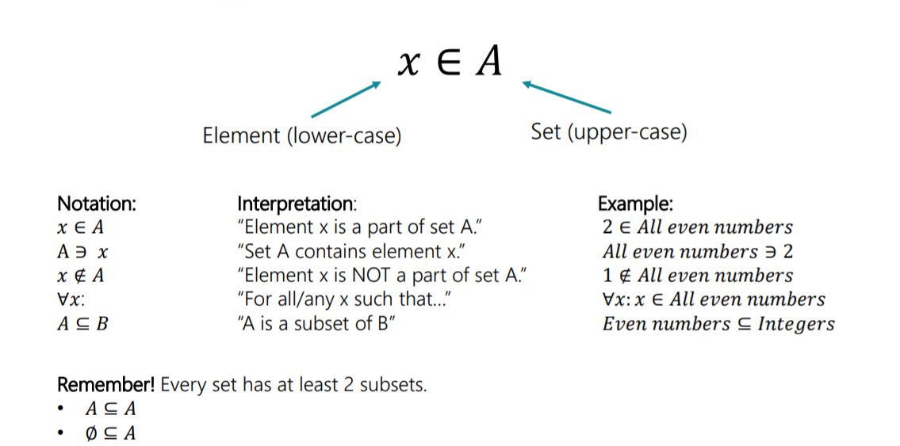
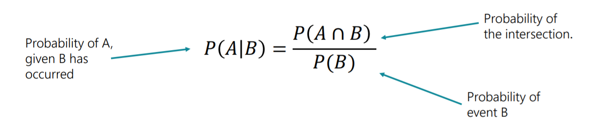
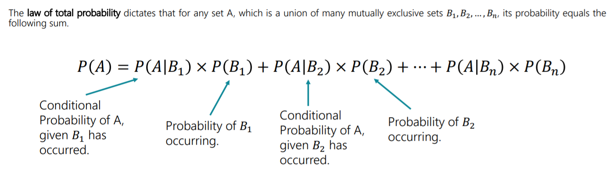
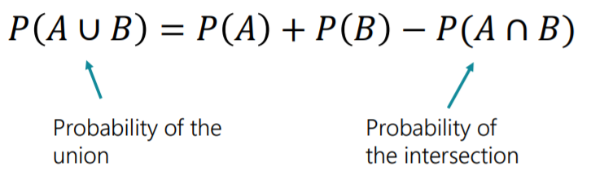
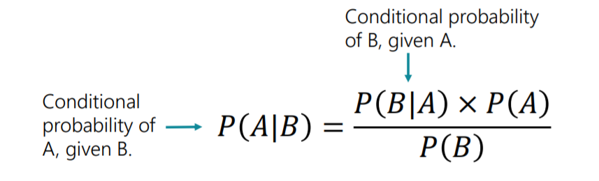

# bayesian-inference
* A **Set** is a collection of elements which can hold a cetain values. additionally every event has a set ofg outcomes that satisfy it. 
* The null set or empty set is denoted by phy

* If A intersection B is Phy then two sets are **muttually exclusive**
* all complements are mutually exclusive but not all mutally exclusivee sets are complements

### Independent dependent events
* If the likelihood of event A occouring P(A is affeceted by event B occouring then we say that A and B are **dependent** events, If it isnt then both are independent events. 

> P(A | B) - Probability of event A occouring given event B has already occoured. 
> For independent events P(A | B) = P(A)

### Conditional Probability
* For any two events A and B such that the likelihood of B occouring is greater than 0 P(B) > 0, the conditional probaility forumula states the following: 

> For independent events P( A | B) = P(A) X P(B)
### Law of total probability 

### Additive Law
* The additive law calculates the probability of the union based on the probability of the individual sets it accounts for

### bayes' law
* Bayes’ Law helps us understand the relationship between two events by computing the different conditional probabilities.
We also call it Bayes’ Rule or Bayes’ Theorem.

