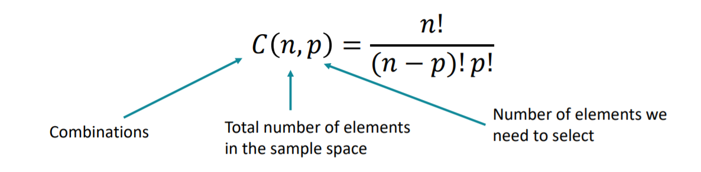

# combinatorics

* Deals with combinations of object from specific finite sets.

### Permuatations

* It represents the number of different possible ways we can **arrange** a number of elements(digits, numbers , objects, people , etc). 
> **P(n) = n X (n-1) X (n-2) X ... X 1**
* It has **no repitations**
* P(n) = n!

### Factorials 
* It expresses the product of all integers from 1 to n and we denote it with symbol !
* 0! = 1
* if n < 0, factorial doesnt exist 
> **Rules for factorial multiplications**
(N + K)! = N! X (N+1) X ... X (N + K)
(N - K)! = (N!) **/** ( (N-k+1) X (N-K+2) X ....(N) )
N! / K! = (K + 1) X ... X N if N > K

### Variations (arrange things out of n)

* Represents the number of possible ways we can pick and arrange a number of elements 

### Combinations (Select things out of n)
* represents the number of different possible ways we can pick a number of elements from a set . 

* this takes into account double counting, (selecting 1, 2, 3 is same as selecting 3, 2 ,1 so this will be considered once)
* all the different permuations of single combinations are variations

