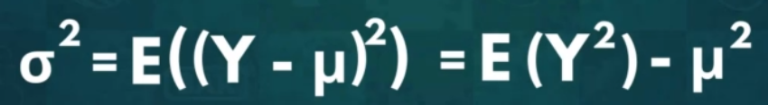

# Distributions 
* A distributions shows the possible values a random variable can take and how frequently they occour.
* **Important Notations**
1. Y - The actual outcome of event
2. y - One of the possible outcomes
3. One way to denote the liklihoo dof reaching a particular outcome **P(Y=y) or P(y)**
4. **Example** - Y -> The number of red marbles we draw out of a bag. and y -> 5 marbles then We express the probility of getting exactly 5 red marbes as: **p(Y=5)** or **p(5)**

### Probability Frequency Distribution
* **When therer are finite number of possible outcomes** - We record the frequency for each unique value and divide it by the total number of elements. 
* **When there are infite number of possibilities** - The recording probaability for each one becomes impossible. 
* Regardless of finite or infinite possibilities we **define distribution using two properties:**
    * **mean**(Greek letter mu) - It is the average value of the distribution
    * **variance**(Greek Letter Signma sqaure) - It is **how spread out data is** we measuere this spread by how far away from the mean all the values are. The more **disperce** data is the higher will be it variance. 
 

* **Population** - Formal way of reffering all the data
* **Sample Data** - It is just a part of the population. We adopt different mean and variance notations for mean and variance. 

* **NOTE** - One flaw of variance is it is measured in square units, if mean is in seconds then variance will be in seconds sqaure. There is no direct interpretation of this values. 

**Standard Deviation** - It is positive sqaure root of variance. Measured in same unit as mean hence easily interpretable. This is denoted by sigma in population and s in sample data. 

* **NOTE** - Any value betwwen **(mu-sigma)** and **(mu + sigma)** falls within one standard deviation away from mean. The more congested middle of distribution is  the more data falls within that interval similarly the less data falls within the interval the less dispersed the data is. 

* **Relationship between Mean and Variance** - By defination the variance equals the expected value fo the squared difference from the mean for any value. 

#### Calculating Variance 
* **For population** 

* **For variance**

#### Calculating Standard Deviation 
* SD is **positive sqaure root of variance**. 
* Find the mean, which is the arithmetic mean of the observations.
* Find the squared differences from the mean. (The data value - mean)2
* Find the average of the squared differences. (Variance = The sum of squared differences ÷ the number of observations)
* Find the square root of variance. (Standard deviation = √Variance)

 

### Types of prbability distribution
* Certain distribution share certain properties so they are grouped in one category. 
* **Discreate Distributions** - When there are finite number of outcomes, like rolling a die, picking a card. 
* **Continious Distribution** - When there are infinitely many outcomes. 
* **NOTATION FOR WRITING DISTRIBUTUTION** 

N - Type of distribution 
Charecteristics of data set. It can vary based on type of distribution . 

### Discreate Distribution. 
> **Charecteristics**
> * Have a finite number of outcomes.
> * Can add up individual values to determine
probability of an interval.
> * Can be expressed with a table, graph or a piece-wise function.
> * Expected Values might be unattainable.
> * Graph consists of bars lined up one after the other.
> * 𝑷 𝒀 ≤ 𝒚 = 𝑷 𝒀 < 𝒚 + 𝟏

* **Equiprobable** - All outcomes are equally likely. Like toss a coin, picking a card. These follow **Uniform Distribution** 

* **Bernoulli Distribution**- Events with only two possible outcomes true or false and this has only ** Single trial**. Any event with two outcomes can be transformed into this. We simply assign one to be true and other to false.  

* **Binomial Distribution** - Carrying out a similar experiment several times in a row. The outcomes for each iteration is two but we have many iternations.

* **Poisson Distribution** - This is used to test out how unusual an event frequency is for a given interval. For example, LeBron James average is 35 so how likli hood of lebron scoring 12 points in a game. 

### Continious Distribution
Since we are talking about continious distribution the plot will be a curve and not unconnected individual bars

* **Normal Distribution** - Outcomes of many events in nature cosely resemble this distribution. Like wt of polar bears in last few decades. Extreme values are called **out-liners**.  Like if avg wt is 500 then 350 and 700 are called outliners. 

* **Student's T-distribution** - Sometimes we have limited data for a normal distribution so then this is used. It is **A small sample approximation of a normal idstribution** , This accomodates extreme values much better,The **tails are fatter than normal distribution.** due to this tails represents a larger population. 

* **Chi-sqaured distribution** - It is the first **asymmetric continious distribution we are dealing with as it only consists of non negative values**. Graphically Chi-Sqaured distribution starts from a **zero from the left**. Depending upon the **average and maximum values** within the set of curve the chi sqaured is typically **skewed to the right**. This does not mirror real life events and is usually used in **hypothessis testing** to help determine **goodness of fit.** 

* **Exponential distribution** - It usually present when we are dealing with **events that are rapidly changing early on**. Example - How online new article generate hits, as most hits would come initially when the topic is fresh. 

* **Logistic Distribution** - We often find it **useful in forecast analysis when we try to determine a cutof point for succesful outcome**. Example - How much of an in-game advantage is nessesary to predict victory. Our predictions would never reach `true certainity`. 
