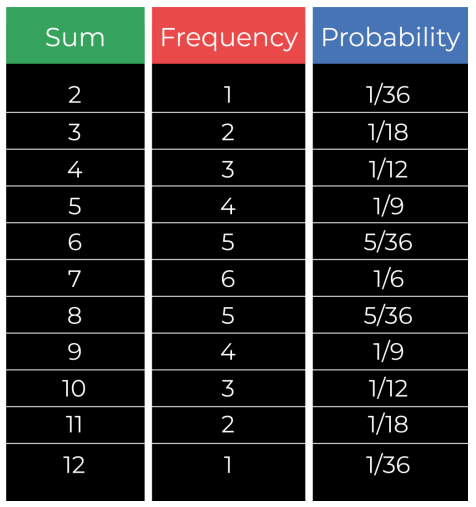

# Probability 

* It is likelihood of an event occouring
* These are written as **real numbers** between **0 to 1**
* 0 - Absolute Uncertainity , 1 - Highest Likelihood

> **P(A) = preffered (favourable) / all (Sample Space)**

**NOTE** - Probability of two independent events occouring at same time is equals to product of probability of each event. 
> **P(AB) = P(A) X P(B)**

### Expected Value
* **Trial** – Observing an event occur and recording the outcome.
* **Experiment(multiple trials)** – A collection of one or multiple trials
* **Experimental Probability** – The probability we assign an event, based on an experiment we conduct. This is not **true probability**, this is used when we cant get true probability
* **Expected value** – the specific outcome we expect to occur when we run an experiment.

> **Experimental Prob: successfull trials/total trials**
> **Expected probability E(A) = the outcome we expect to occour when we run the experiment**
> **For categorical data - E(A) = P(A) X n(number of trials)**

 

### Probaility Distribution

* It is collection of the probabilitiies for each possible outcome expressed as graph or table.
* to get the probability from out just divide the frequency by the number of possible outcomes
* probability distribution table for rolling two dice, for this we write frequency in ascending order.

### Complement(Opposite of event)

* Complement is everything an event is not
> **P(A) + P(A-complement) = 1**

* it can never occour simultaneously 
* It will add up to sample space = A + A` = sample space
* The probabilities adds up to 1
* The complement of complement is event itself 

